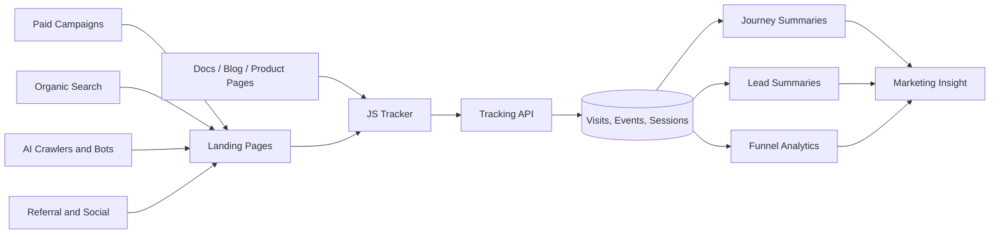
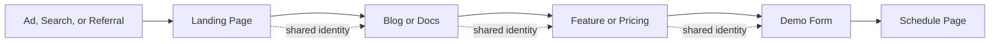
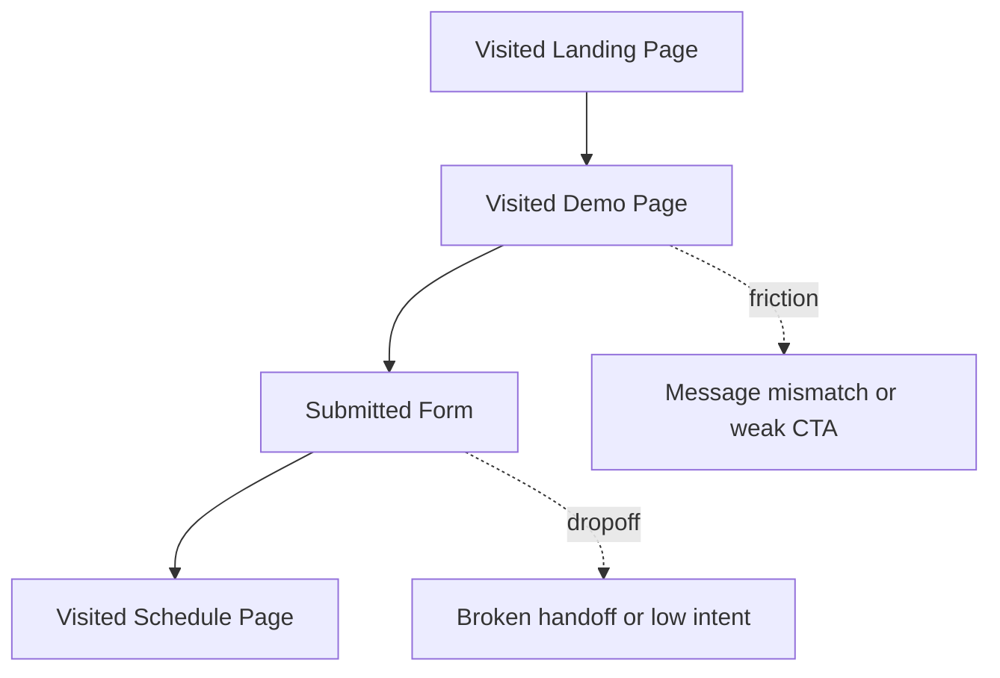
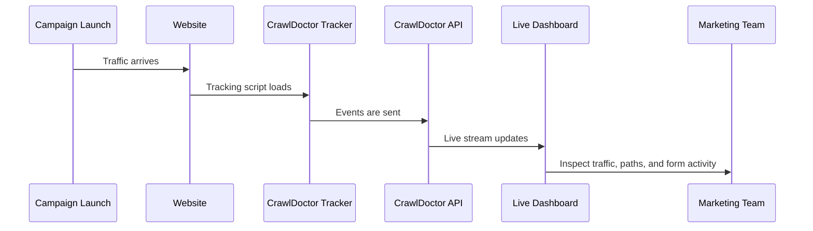

# Using CrawlDoctor for Marketing: Tracking Human Users, AI Bots, and Conversion Signals

## Challenge

Marketing analytics is entering an uncomfortable transition period. The metrics still look familiar, but the environment underneath them has changed. Traffic is no longer shaped only by humans arriving through search, social, and paid campaigns. It is also shaped by AI crawlers, answer engines, automated retrieval systems, and machine-mediated discovery. At the same time, the modern buyer journey has become more fragmented. A prospect may encounter a company through an educational article, return through a branded search, explore docs on another domain, click into a product page, and convert only after several non-linear visits.

Yet most marketing reporting still behaves as if the web were stable, human-only, and last-click legible. It tells us where sessions came from, but not whether those sessions belong to real demand, machine discovery, or long-tail journey formation. It counts conversions, but often fails to distinguish meaningful submissions from analytics noise. It shows top pages, but rarely reveals which pages are influencing journeys across channels and properties.

That is precisely why CrawlDoctor matters in a marketing context. It is not only a traffic tracker. It is a way to observe the emerging shape of attention on the web.

## Solution

CrawlDoctor gives marketing teams a first-party layer for understanding both human behavior and machine visibility. It combines browser-side tracking, backend enrichment, attribution logic, journey stitching, lead capture, and funnel analysis into one system. The result is that marketers can stop asking only, “How much traffic did we get?” and start asking more strategic questions: “Who is discovering us?”, “How are they moving?”, “Which pages are shaping demand?”, and “What is the relationship between machine attention and human conversion?”

That shift in questioning is where the product becomes strategically useful. CrawlDoctor does not merely improve dashboards. It changes the type of marketing insight a team can produce.

## A New Analytics Reality for Marketing Teams

The rise of AI systems has quietly changed the top of the funnel. Discovery is no longer confined to search rankings and referral clicks. Content is now being surfaced, summarized, indexed, and revisited by systems that may never appear in a traditional campaign report. Some of that activity is exploratory. Some of it is retrieval-oriented. Some of it may signal future visibility in AI-assisted interfaces. Whether or not every crawler visit translates directly into revenue, it still says something important about how a brand’s digital surface is being interpreted by the broader machine layer of the internet.

At the same time, high-intent human journeys are becoming more distributed. A marketing team may run paid traffic to a landing page, but the buyer who eventually converts could spend most of their serious evaluation time somewhere else: on docs, feature pages, benchmarks, or scheduling flows. If those surfaces live on different domains, many analytics stacks fracture the story beyond repair. CrawlDoctor was built to hold that story together.

## The Marketing Architecture of CrawlDoctor

Seen through a marketing lens, the architecture is less about events and tables and more about preserving continuity from discovery to conversion.

The reason this matters is that marketing strategy increasingly depends on understanding not just isolated channels, but the interplay between attention, evaluation, and conversion. CrawlDoctor allows those layers to be examined together.

## Why Bot and AI Traffic Should Not Be Treated as Pure Noise

For years, the standard advice in marketing analytics was to clean bot traffic out of the dataset as quickly as possible. That advice made sense when bots were mostly a contamination problem. Today, that posture is incomplete.

Not all bot traffic is operationally valuable, but some of it is strategically informative. If AI crawlers are repeatedly visiting certain content, that may reveal something about how your site is being positioned for machine-mediated discovery. If answer-engine-adjacent systems are concentrating attention on a few pages while ignoring others, that may tell you which parts of your content architecture are legible to emerging discovery systems and which are not.

CrawlDoctor’s bot detection matters here because it preserves classification rather than defaulting to deletion. It can identify traffic associated with systems such as `GPTBot`, `ClaudeBot`, `PerplexityBot`, `Google-Extended`, and other known or suspicious agents. For a marketing team, this creates a new surface of analysis. Instead of asking only which pages rank or convert, they can ask which pages are visible to machines, which assets attract repeated crawler attention, and where machine discovery overlaps with human buyer behavior.

That overlap is where thought leadership, SEO, and conversion strategy start to converge.

## Content Strategy Becomes More Nuanced When You Can See Both Humans and Machines

One of CrawlDoctor’s most interesting uses in marketing is content diagnosis. Most teams can already identify pages with traffic. Fewer can identify pages with the right kind of traffic. A blog post that attracts AI crawlers but no meaningful human progression may be discoverable but commercially weak. A feature page that drives human conversion but little machine attention may be persuasive once found, but underexposed at the discovery layer. A docs page that attracts both sustained crawler activity and recurring appearances inside converting journeys may be far more valuable than its surface-level visit count suggests.

This is where CrawlDoctor helps marketing move beyond vanity metrics. Because the system records page context, crawler classification, attribution fields, path progression, and conversion signals in one stack, it becomes possible to ask better questions about content performance. Which pages are being revisited by AI systems? Which pages are part of early-stage evaluation? Which pages repeatedly appear before a demo form? Which pieces of content seem to act as bridges between awareness and intent?

Those are not ordinary pageview questions. They are market understanding questions.

## Attribution Is More Useful When It Lives Inside Journeys

Campaign attribution remains essential, but the way most teams consume it is too narrow. Source, medium, and campaign tags usually end up attached to sessions and conversions in a way that feels technically correct but strategically shallow. They tell you where a visit came from, not what happened to that person afterward.

CrawlDoctor is stronger here because attribution is not isolated from identity and path reconstruction. UTM fields and referrer signals are captured early, attached to visits and events, and then made legible at the journey level through `client_id` continuity. That means marketers can stop viewing attribution as a single event label and start viewing it as the opening context for a buyer journey.

This changes how campaign analysis can be done. A paid campaign may not look exceptional on last-click conversion, but it may consistently originate journeys that later convert through product or demo flows. A referral source may appear modest by volume, but its users may move through the site with unusually high intent. An organic content cluster may rarely serve as the final touchpoint, yet repeatedly show up in the path sequence of qualified leads. CrawlDoctor allows those distinctions to emerge.

## Cross-Domain Journeys Are a Marketing Problem, Not Just a Technical One

Many marketing organizations have outgrown the single-domain model without fully realizing it. The blog lives in one place, docs in another, the product in another, and campaign pages somewhere else. Brand-wise, it feels like one experience. Analytically, it often becomes four disconnected systems.

CrawlDoctor addresses this through persistent client identity and cross-domain handoff. The browser tracker can carry `cd_cid` across internal links, and the backend can resolve whether subsequent visits belong to a continuous journey or a new entry. That makes a cross-domain path visible in a way that standard session models often cannot support.

This matters because many of the most commercially important journeys are not linear and not confined to a single property. When marketing cannot see them, it tends to over-credit the final page and underinvest in the earlier surfaces that actually create conviction.

## Conversion Tracking Needs More Judgment Than Most Teams Realize

Another reason CrawlDoctor is useful in marketing is that it treats lead capture with skepticism. That sounds subtle, but it is critical. Many stacks inflate conversions by trusting anything that looks vaguely like a form submission. In practice, some of those signals are telemetry, some are search forms, some are noisy third-party payloads, and some have little or nothing to do with buyer intent.

CrawlDoctor filters aggressively for meaningful form submissions, preserves multiple real form fills through `journey_form_fills`, and surfaces faster access patterns through `lead_summaries`. That means marketing teams can work from a cleaner model of demand. Instead of asking only how many submissions occurred, they can ask which sources generated credible leads, which pages captured them, what their path looked like before they converted, and whether certain journeys are producing repeated form activity before a scheduling handoff.

This is one of the quiet strengths of the product. Good marketing strategy depends on conversion data, but great marketing strategy depends on trustworthy conversion data.

## Funnels Become More Powerful When They Are Connected to Real Paths

CrawlDoctor’s funnel analysis is useful because it is grounded in the same event and journey system rather than bolted on as an isolated report. Marketers can define conversion paths such as a landing page progressing to `/demo`, then to `form_submit`, and finally to `/schedule`. But the value is not only in seeing stage counts. The value is in being able to connect those stages back to actual user paths and campaign origins.

Once those paths are visible, funnel analysis becomes more diagnostic. A drop between landing page and demo page may suggest weak messaging continuity. A drop after the form may point to scheduler friction or poor handoff design. A campaign that drives high top-of-funnel volume but low form quality may need not just better media targeting, but different page architecture.

This is where marketing analytics becomes operational rather than descriptive.

## Live Data Changes How Teams Launch Campaigns

There is also a more immediate use case: real-time monitoring. CrawlDoctor’s Live Data view and event stream let marketers observe what is happening as a launch unfolds. During a campaign rollout, webinar push, pricing-page experiment, or major content release, that visibility becomes unusually helpful.

In practice, this means a team can verify whether the right audiences are arriving, whether the expected pages are receiving attention, whether form interactions are firing correctly, and whether bot activity spikes around newly published assets. That kind of operational confidence is surprisingly rare in marketing systems, especially during moments that matter.

## CrawlDoctor as a Strategic Layer for Modern Growth

The deeper point is that CrawlDoctor can serve as a first-party intelligence layer on top of the broader growth stack. It does not need to replace CRM systems, BI tools, advertising platforms, or SEO suites. Its value lies in what those systems often cannot do well on their own: hold together bot visibility, human journeys, conversion signals, and multi-domain continuity in one place.

That makes it particularly useful for teams operating in environments where brand discovery, content depth, and demand generation increasingly intersect. If your growth motion depends on content, docs, product education, demos, and AI-era discoverability, then marketing needs a way to observe those layers as part of one coherent system. CrawlDoctor gives that system shape.

## Results

Used well, CrawlDoctor changes the quality of marketing questions a team can ask. It makes it possible to see which pages attract machine attention, which journeys generate credible leads, which campaigns initiate long-form buying paths, and which content acts less like a traffic asset and more like a conversion catalyst. It helps marketers understand not only what happened, but what kind of attention they are earning and how that attention develops into demand.

That is the larger promise of the product. In a web environment increasingly shaped by both humans and machines, marketing needs analytics that can observe both. CrawlDoctor is valuable because it takes that reality seriously.

## Key Takeaways

The most important shift is conceptual. Bot traffic is no longer always just noise. Attribution is no longer enough when detached from journeys. Content performance is no longer fully explained by pageviews. Conversion reporting is no longer trustworthy if form signals are not filtered carefully. And multi-domain buyer behavior is no longer a special case; for many teams, it is the norm.

When those realities are taken together, marketing needs a new kind of observational layer. CrawlDoctor is our answer to that need: a system for understanding not just traffic, but attention, movement, intent, and the emerging relationship between machine visibility and human conversion.
