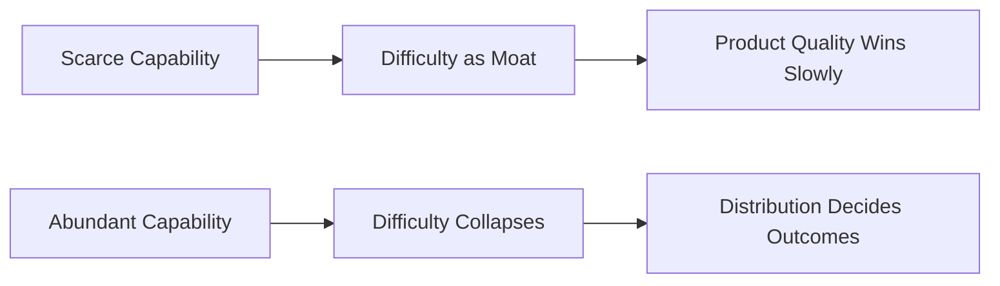
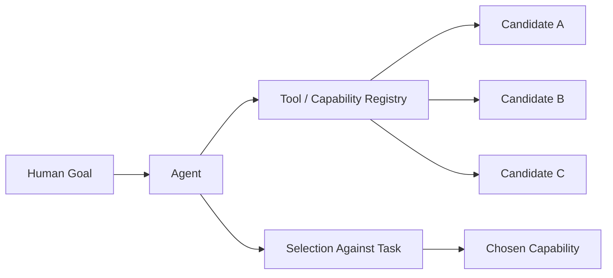
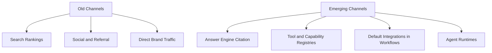
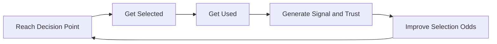
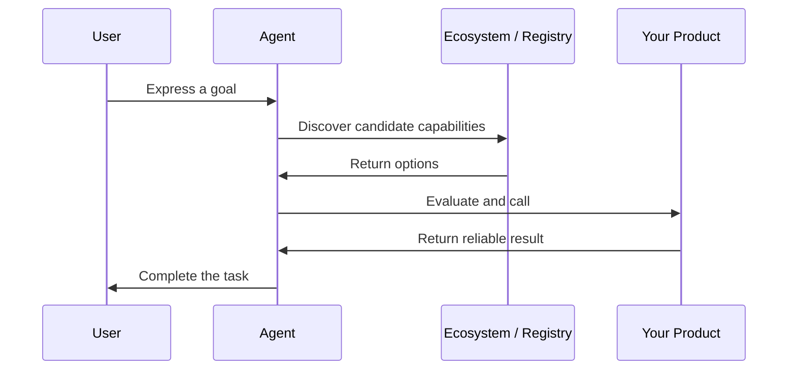

## Challenge

There is a comfortable story that builders like to tell themselves. Build something genuinely good, the story goes, and the world will find its way to your door. Quality is the moat. Everything else is marketing.

That story was always a little romantic, but for most of the software era it was at least survivable. A better product could win a category slowly, through word of mouth, switching, and patience. The problem is that the conditions that made it survivable are dissolving. Capability is getting cheaper and more uniform. The same model weights, the same orchestration patterns, and the same agent scaffolding are available to almost everyone within months of being invented. The gap between the best implementation of an idea and the tenth best is collapsing toward zero.

At the same time, the thing on the other side of the product, the audience, is changing shape. The buyer is no longer reliably a human browsing, comparing, and deciding. Increasingly the buyer is an agent acting on a human's behalf, retrieving options, ranking them against a goal, and selecting one without anyone ever seeing a landing page. The web is being read and acted upon by software that does not browse the way people do.

So we are left with an uncomfortable combination. The cost of building falls. The number of credible competitors rises. And the entity choosing between them is often a machine optimizing for a task rather than a person responding to a brand. In that environment, the old reassurance that good products win on their own is not just incomplete. It is dangerous.

## Solution

The advantage that survives this transition is distribution. Not distribution in the narrow sense of running ads or posting on social platforms, but distribution as a discipline: the set of durable mechanisms by which your product reaches the place where a decision is made, and gets chosen there.

This is not a new idea. The observation that distribution beats product more often than founders expect has been around for decades. What is new is the urgency. When capability was scarce and hard to copy, a strong product could carry weak distribution for a long time. When capability is abundant and easy to copy, weak distribution kills strong products quickly, because someone with equal capability and better reach will get to the decision point first.

The age of agentic AI sharpens this in a specific way. The decision point itself is moving. It is shifting from human attention, which you win through messaging and brand, toward machine selection, which you win through being discoverable, callable, trusted, and embedded. Distribution is how you show up at the new decision point. Everything below is an attempt to take that seriously.

## The Commoditization of Capability

For most of the last era, capability was the scarce resource. Building a high quality product required rare talent, real time, and accumulated craft. That scarcity created defensibility almost as a side effect. If something was hard to build, the difficulty itself kept competitors away.

Agentic AI erodes that side effect from two directions at once. It lowers the cost of building, because a small team can now produce what used to require a large one. And it accelerates the spread of good ideas, because the moment a useful pattern appears, it can be described, replicated, and improved upon by anyone with access to similar models.

The point is not that quality stops mattering. Quality is still the price of entry, and bad products still fail. The point is that quality stops being sufficient. When many teams can reach a similar level of capability, the question is no longer who can build the best thing. It is who can get a good enough thing in front of the right decision, repeatedly and reliably. That is a distribution question, not a capability question.

## When Your Customer Is an Agent

The most underappreciated shift is who you are actually selling to. We still design products as if the user is a person who will read, evaluate, and feel something. More and more often, the first entity to encounter your product is an agent operating on a person's behalf.

An agent does not experience your homepage. It does not respond to a clever tagline or a beautiful animation. It reads structured surfaces, queries registries, evaluates capabilities against a task, and makes a selection. If your product is not legible to that process, it does not lose on the merits. It is never considered at all.

This reframes distribution in a concrete way. Being discoverable to humans meant ranking in search, earning links, and building recognition. Being selectable by agents means something adjacent but distinct: being present in the registries and ecosystems agents draw from, exposing your capability in a form an agent can understand, and being described in language that maps cleanly to the tasks agents are trying to accomplish. The surface you optimize is no longer only the page a person sees. It is the interface a machine reads.

## Distribution Channels Are Being Rewritten

It would be convenient if the new channels were simply the old channels with a coat of paint. They are not. The places where decisions get made are migrating.

Search is being mediated by answer engines that summarize rather than list, which means appearing in an answer matters more than ranking on a page. Discovery is increasingly happening inside agent runtimes and tool ecosystems, where being a registered, callable capability matters more than having a marketing site. Integration surfaces, where your product becomes a default option inside another product's workflow, are becoming distribution channels in their own right, because the agent that already lives in that workflow will reach for what is already there.

None of the old channels disappear. People still search, click, and remember brands. But the center of gravity is moving, and the teams that treat the emerging channels as a curiosity rather than a frontier will find themselves well distributed for a web that is slowly ceasing to be the primary one.

## Being Selectable Is the New Being Discoverable

There is a difference between being found and being chosen, and agentic systems make that difference sharp. A human who finds three reasonable options might pick the one with the nicer brand, the familiar name, or the better story. An agent comparing the same three options against a task will tend to pick the one that most clearly fits, that is easiest to call, that returns the most reliable result, and that imposes the least friction on completing the goal.

This rewards a kind of legibility that marketing has historically undervalued. Clear capability descriptions. Predictable interfaces. Documented behavior. Reliability under repeated use. These are not features in the traditional sense. They are distribution assets, because they directly affect whether you survive an agent's selection process. In a human-mediated world, ambiguity could be smoothed over with persuasion. In a machine-mediated world, ambiguity is a reason to be skipped.

The teams that internalize this stop thinking of clarity and reliability as engineering hygiene and start thinking of them as go-to-market strategy. Being the option an agent can confidently reach for is distribution.

## The Compounding Nature of Distribution

Distribution is not only about reaching the decision point once. Its real power is that it compounds, and the compounding is what turns a temporary edge into a durable one.

Every time your product is selected and used well, several things happen at once. You accumulate evidence of reliability that makes future selection more likely. You build presence in the ecosystems and defaults that route future decisions toward you. And you gather feedback that improves the product, which improves selection again. A product with a working distribution loop does not merely reach more people. It becomes harder to dislodge, because each cycle strengthens the position that produced it.

Capability does not compound like this. A capability advantage erodes as others catch up. A distribution advantage, once it is wired into defaults, ecosystems, and accumulated trust, tends to defend itself. This is why distribution so often beats product over a long enough horizon, and why the horizon is getting shorter.

## Why Builders Systematically Underrate This

If distribution matters this much, why do so many capable teams neglect it? The honest answer is that the people who are best at building are often the people least inclined to think about reach. Distribution feels like someone else's job, a thing to attend to after the real work of building is done. There is also a moral comfort in believing that merit alone should win, which makes investing in distribution feel slightly like cheating.

Agentic AI punishes this bias more severely than the old world did. When building was slow and hard, a team could neglect distribution for a year and still recover, because no one else had caught up on the product. When building is fast and cheap, that year is fatal, because a competitor with equal capability and a deliberate distribution strategy will occupy the decision point while the better builder is still polishing. The bias toward product over distribution was always a tax. It is becoming a death sentence.

## What Distribution Looks Like in Practice

Concretely, taking distribution seriously in this era means designing for the new decision point from the start rather than bolting it on later.

It means making sure your capability is present in the registries and ecosystems agents actually consult, not just the websites humans visit. It means describing what you do in language that maps to tasks, so an agent comparing options understands the fit. It means treating reliability and clear interfaces as competitive assets, because they decide whether you survive selection. It means pursuing the integrations and defaults that put you inside workflows where decisions already happen. And it means building the feedback loops that let usage compound into trust.

None of this replaces building a good product. It is what gives a good product the chance to matter. The work is to hold both at once: enough capability to deserve selection, and enough distribution to actually be selected.

## Results

When a team takes distribution seriously in the agentic era, the change is not cosmetic. It alters which products survive. The products that win are not always the most capable ones. They are the ones that reliably show up at the decision point, in a form the decider can understand and trust, with a loop that makes each selection more likely than the last.

This is uncomfortable for anyone who wanted to believe that building the best thing was enough. But it is also clarifying. It tells you where to spend attention you might otherwise waste. It tells you that legibility, presence, and reliability are not afterthoughts but strategy. And it tells you that in a world where capability is abundant and the buyer is increasingly a machine, the scarce and defensible thing is the ability to be reached and chosen.

## Key Takeaways

The shift underneath all of this is conceptual. Capability is no longer scarce, so it is no longer a sufficient moat. The buyer is no longer reliably human, so persuasion no longer wins the decision on its own. The channels are no longer the familiar ones, so optimizing only for human discovery leaves you absent from where decisions are moving. Selection now rewards clarity, reliability, and presence, which means those are strategic assets rather than engineering details. And distribution compounds in a way capability does not, which is why over a long enough horizon it tends to win.

The conclusion I keep arriving at is simple to state and hard to live by. In the age of agentic AI, build something worth choosing, and then take just as seriously the question of whether anything, human or machine, will ever be in a position to choose it.