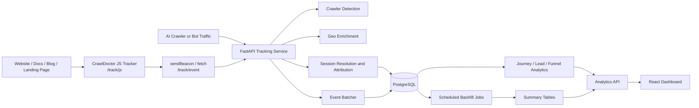
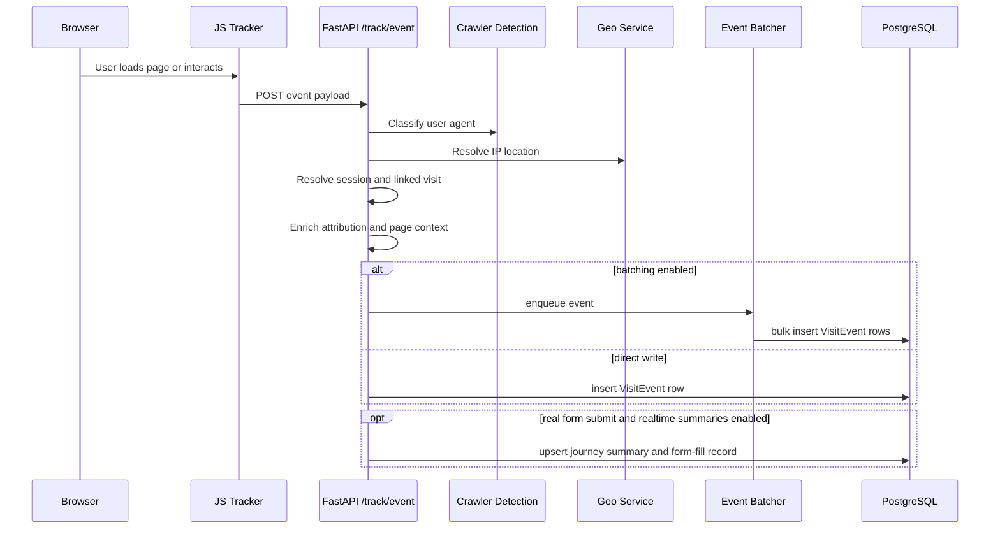
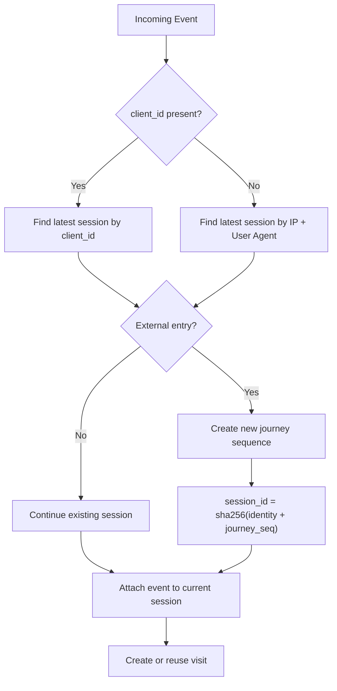
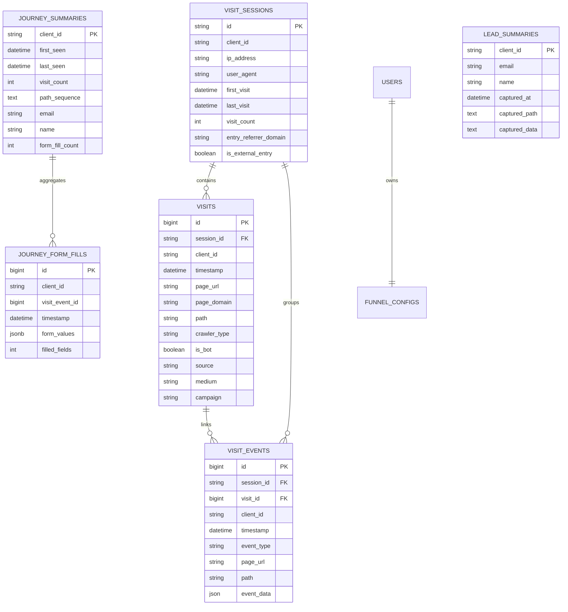

# How We Built CrawlDoctor

## Challenge

The web analytics stack most teams inherit was designed for a simpler internet. It was built for pageviews, sessions, and campaign tags, with the quiet assumption that a visitor was usually a human on a browser and that a conversion could be understood as a tidy sequence of clicks on a single domain. That assumption no longer holds.

Modern traffic is mixed. Human users still arrive from search, social, email, and product ecosystems, but they now share the surface area with AI crawlers, answer-engine bots, automated research agents, preview systems, and machine-driven retrieval flows. At the same time, the customer journey itself has fractured. A prospect might discover a company through a blog post, move into docs, cross into a product domain, return from a remarketing campaign, and only later fill out a demo form. Traditional analytics can count fragments of that activity, but it rarely tells a coherent story.

CrawlDoctor was born from that gap. We did not want another dashboard that merely counted traffic. We wanted a system that could explain how modern web attention behaves: how AI systems discover content, how humans move across properties, how conversion journeys form, and how to preserve enough fidelity to answer these questions without drowning the product in noise.

## Solution

We built CrawlDoctor as a full-stack analytics platform whose job is not simply to record events, but to preserve context. At the center of the system is the idea that modern analytics needs three things working together: browser instrumentation, backend enrichment, and opinionated summarization.

On the client side, we serve a lightweight JavaScript tracker from `/track/js`. It is intentionally easy to embed, but the script does far more than emit a pageview. It captures page views, clicks, scroll depth, visibility changes, heartbeats, route transitions in SPA-style applications, and sanitized form activity. It also establishes a persistent client identity, which becomes the backbone of cross-session and cross-domain stitching.

On the backend, a FastAPI service receives these interactions through `/track/event`, enriches them with user-agent classification, geographic context, attribution data, and session logic, and then writes them into PostgreSQL. The backend is not a passive collector. It decides whether an event belongs to an existing journey, whether it should be linked to a recent visit, whether it represents a real conversion signal, and whether it should contribute to derived summaries.

On top of the raw event store, we built a reporting layer that produces journey summaries, lead summaries, funnel views, exports, and live operational dashboards. That separation between raw data and reporting data became one of the most important architectural decisions in the project.

## Architecture

At a high level, CrawlDoctor is organized as a data pipeline with feedback loops for analysis and operational monitoring.

What looks simple in the diagram is actually the result of several deliberate tradeoffs. We chose FastAPI because it let us build a high-throughput async service without giving up development speed. We chose PostgreSQL because the product needed a relational model that could handle raw events, derived tables, and analytical queries in the same operational system. We chose React for the dashboard because the UI needed to support both standard reporting views and more investigative workflows such as live event inspection, session timelines, and journey analysis.

## The Browser Tracker as a First-Class Product Surface

One of the most important decisions in CrawlDoctor was to treat the tracker as a product surface rather than as a throwaway snippet. In many analytics systems, the client script is little more than a pageview shim. In CrawlDoctor, the tracker is where identity, intent, and instrumentation begin.

The script establishes a persistent `client_id` in browser storage and cookies, then uses that identity to decorate internal cross-domain links with `cd_cid`. That detail is small at the code level, but large at the system level. It means a user who starts on one property and ends on another does not become analytically invisible the moment they cross a hostname boundary. In practice, that is what makes multi-domain marketing and product journeys legible.

The tracker also captures client-side context once and then reuses it efficiently. Timezone, viewport, language, screen resolution, device memory, and connection type are not glamorous fields, but they become surprisingly helpful when trying to explain real-world behavior, distinguish environments, or debug discrepancies between server-side and client-side assumptions.

Just as importantly, the tracker is selective. It sanitizes form values, rejects sensitive fields, avoids hidden inputs, drops suspicious payloads, and ignores analytics noise that would otherwise pollute downstream reporting. In other words, the client is not only a collector; it is the first line of judgment about what deserves to enter the system.

## Ingestion Is Where Context Is Won or Lost

Once an event reaches `/track/event`, CrawlDoctor moves from instrumentation into interpretation. This is the point in the architecture where many analytics systems flatten reality into a row and move on. We took the opposite approach.

Each event is evaluated in the context of user agent classification, page URL structure, referrer signals, UTM parameters, recent visit history, and the presence or absence of a client identifier. The service tries to understand not just what happened, but what that action means inside the current journey. Is this a continuation of an existing session? Is it a new external entry? Should it be linked to a visit created moments earlier? Does the event represent a real form submission or merely telemetry noise masquerading as one?

This is also where performance starts to matter. Event writes can become expensive quickly, especially once the platform begins tracking not only page hits but engagement events, route changes, and form interactions. That is why CrawlDoctor includes an in-process event batcher. Instead of paying full write overhead on every interaction, the system can queue and flush events in batches, reducing pressure on the database while preserving event fidelity.

## Session Resolution as a Strategic Capability

Session logic is often treated as a legacy concept, but in CrawlDoctor it became a strategic capability. We did not want to inherit the fragile assumptions of browser-tab sessions or midnight resets. We wanted a model that reflected how people actually move through related web properties.

The service prefers `client_id` when it exists and falls back to `ip_address + user_agent` when it does not. From there, it decides whether the current interaction represents continuity or a fresh external entry. Heartbeats, scrolls, and visibility changes are continuity signals. Referrer domains and attribution metadata help distinguish an internal continuation from a new inbound journey. When a new journey is warranted, the service generates a session ID from canonical identity plus a journey sequence counter. The result is a session model that behaves more like a journey container than a browser artifact.

This turned out to be one of the core differentiators of the system. It let us treat cross-domain activity as a continuous experience when the evidence supported continuity, while still preserving new-journey boundaries when a user arrived from a meaningful external source.

## Detecting Bots Without Throwing Away the Story

A lot of analytics products solve bot traffic by filtering it out. That is useful if your only goal is “clean traffic,” but it is insufficient if your goal is to understand how your digital surface is being consumed. CrawlDoctor needed a different posture. We wanted to classify machine activity, not erase it.

The crawler detection service evaluates known AI patterns such as `GPTBot`, `ChatGPT-User`, `ClaudeBot`, `Google-Extended`, `PerplexityBot`, and related signatures. It also checks for generic bot markers, suspicious automation fingerprints, and browser-like characteristics that point toward human traffic. The classifier returns not just a binary label, but also a crawler name, a confidence score, and a detection method.

That information is then carried into visits and event payloads, which means bot activity can be analyzed as part of the broader behavioral system. We can ask which pages attract AI crawlers, which parts of the site experience machine attention before human demand follows, and how machine discovery patterns differ from human conversion paths. The point is not simply to identify bots. The point is to preserve the story that bot activity tells.

## Data Model: Raw Memory and Working Memory

One of the most useful ways to think about CrawlDoctor’s schema is as two layers of memory. The raw tables are the system’s long-term memory. They keep everything we may later need to revisit: sessions, visits, events, referrers, attribution fields, client-side metadata, and form interactions. The summary tables are the system’s working memory. They compress what matters for reporting so the product can answer questions quickly.

The raw layer centers on `visit_sessions`, `visits`, and `visit_events`. These tables are where fidelity lives. The reporting layer centers on `journey_summaries`, `lead_summaries`, and `journey_form_fills`. These are not substitutes for the raw data; they are deliberate accelerators built on top of it.

This dual-memory model is what allowed CrawlDoctor to stay both investigative and operational. If a team needs fast lead tables or clean journey lists, the summary layer answers quickly. If they need to reconstruct a more complex story later, the raw events are still there.

## Form Tracking Required More Skepticism Than Expected

One of the less glamorous but most consequential parts of the system was deciding what counts as a real form submission. The web is full of requests that look conversion-adjacent but are not. Some are telemetry. Some are RUM beacons. Some are analytics payloads. Some are search or filter interactions that should never be mistaken for lead capture.

That is why CrawlDoctor has explicit logic for distinguishing meaningful `form_submit` events from junk. The platform looks for actual user-provided form values, rejects suspicious payload shapes, filters out known telemetry signatures, and preserves only events that behave like real submissions. When a genuine form conversion is found, the system can insert a `journey_form_fills` row and update journey or lead summaries with confidence.

This skepticism is more important than it sounds. If conversion signals are polluted, everything above them becomes unreliable: lead lists, campaign attribution, funnel metrics, and sales feedback loops. A thoughtless collector can make a dashboard look busy. A disciplined collector makes the dashboard trustworthy.

## Reporting, Live Monitoring, and the Operator Experience

The frontend of CrawlDoctor is a React application, but it was designed less like a generic SaaS dashboard and more like an analyst’s console. The pages map to different modes of investigation. The Dashboard gives a high-level view of volume and trends. Live Data surfaces recent events in near real time using Server-Sent Events with polling fallback. Sessions and Journeys let an operator inspect chronology. Funnels show how configured conversion paths behave. Leads and Users make the identity layer explorable. The Embed Guide closes the loop by making rollout operationally simple.

The API surface underneath that UI is intentionally broad. It includes summaries, session detail, unified user activity, journey exports, lead exports, funnel timing metrics, dropoff analysis, and external export endpoints protected by API keys. This was another important decision: analytics products become much more useful when they can serve both interactive workflows and downstream systems.

## Building for Volume Without Pretending to Be a Data Warehouse

CrawlDoctor sits in an interesting middle ground. It is not a lightweight script with a toy database, but it is also not pretending to be a warehouse-native analytics stack. We designed it to handle meaningful operational scale while staying deployable as a coherent application.

That is why the project includes connection pooling, statement timeouts, batch insert behavior, streamed CSV exports, optional event partition support, summary backfill jobs, and administrative rebuild tools. The goal was to make the platform capable of handling sustained event capture and reporting pressure without introducing architectural sprawl too early.

The documented schema snapshot makes that ambition concrete. The system has been structured around hundreds of thousands of session and visit records and millions of event rows. That scale is not extreme by analytics standards, but it is more than enough to force clarity about what belongs in real time, what belongs in scheduled summarization, and what should remain queryable as raw evidence.

## Results

What emerged from this architecture is not just a tracking product, but a first-party intelligence layer for modern web behavior. CrawlDoctor can explain who arrived, whether they were human or machine, how they moved, where they came from, what they interacted with, and whether their journey produced a meaningful conversion signal. It can do that across domains, across multiple stages of a funnel, and across both live and historical analysis.

That matters because the central challenge of modern analytics is not data collection. It is interpretation under complexity. CrawlDoctor was our answer to that problem. We built it to preserve enough context for teams to reason about the web as it actually behaves now, rather than as analytics tools imagined it a decade ago.

## Key Takeaways

The biggest lesson from building CrawlDoctor is that analytics systems become more useful when they stop trying to simplify the world too early. Bot traffic should not always be discarded. Sessions should not always be browser-tab artifacts. Form submissions should not always be trusted at face value. Reporting tables should not replace raw events, and raw events should not be forced to power every dashboard directly.

Thoughtful analytics architecture is really an exercise in deciding where interpretation belongs. In CrawlDoctor, interpretation begins in the tracker, deepens in ingestion, becomes durable in the data model, and becomes accessible through the dashboard. That is what turns event collection into understanding.
